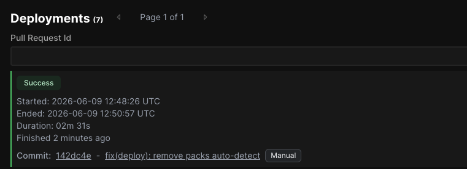

# Calcolatore Rata Finanziamento Auto

## Il caso: 20.000 € di importo, TAN 7%/7,50%/8%, durata 36/48/60 mesi

Cliente in concessionaria vuole sapere subito quanto pagherà al mese. La domanda chiave per costruire il preventivo: le spese di istruttoria (300 €) e la polizza (800 €) le finanziamo dentro l'importo o le facciamo pagare a parte?

**Scelta: finanziate dentro l'importo.** È esattamente quello che fanno tutte le captive bank del mercato. Il cliente firma per 21.100 € totali, riceve i 20.000 € netti che gli servono per la macchina, e paga una sola rata che già contiene tutto.

Risultato concreto a TAN 7% su 36 mesi: rata **651,51 €**, costo totale **23.454,38 €**. Il calcolatore aggiorna i numeri in tempo reale appena cambi i parametri e, con un click sul pulsante "Confronta", **mette due configurazioni fianco a fianco** — per esempio 36 mesi vs 60 mesi, oppure TAN 7% vs 8% — mostrando in colpo d'occhio quanto cambia la rata mensile e il totale dovuto.

## Deploy in 2 minuti e potenziale della pipeline CI/CD

Da quando salvo una modifica al sito a quando i clienti la vedono online passano circa due minuti, completamente in automatico. Salvo il codice, parte una catena di passaggi: il codice viene verificato, costruito e pubblicato sul server, l'applicazione torna online senza un secondo di interruzione e senza che io debba toccare niente manualmente.



In questo progetto uso **Coolify** perché ho un mio server personale (un VPS) che gestisco direttamente — Coolify è un pannello di controllo che lo rende semplice da usare. Lo stesso identico risultato si ottiene su qualsiasi altra soluzione: un VPS più tradizionale gestito via SSH, oppure un ambiente cloud come AWS, Google Cloud, Azure o Laravel Cloud. La pipeline non cambia, cambia solo dove l'app gira.

Prima di arrivare in produzione, ogni proposta di modifica viene controllata in automatico:

- **Test funzionali** che verificano che il calcolo della rata resti corretto — se qualcuno (uno sviluppatore o un'AI) tocca la formula e sbaglia, il sistema blocca il deploy prima che il bug arrivi al cliente
- **Controlli di stile e qualità** del codice, così il progetto resta coerente nel tempo anche con persone diverse che ci lavorano
- **Pubblicazione** solo dopo che la modifica è stata approvata

### Perché vale la pena investirci tempo

Mettere su una pipeline così la prima volta richiede qualche ora di configurazione — onesto, non è zero lavoro. Ma il rapporto costo-beneficio si capovolge dal secondo giorno in poi, e qui sta il punto.

Tutte le operazioni che, in un workflow manuale, lo sviluppatore esegue a mano ogni volta che vuole pubblicare — collegarsi al server, copiare i file, eseguire le migrazioni del database, riavviare i servizi, controllare che nulla si sia rotto — vengono trasferite alla macchina. Vengono eseguite **esattamente nella stessa sequenza, ogni singola volta, senza varianti**. E le operazioni manuali sono esattamente dove nascono i problemi: un file dimenticato, un comando saltato, una versione vecchia caricata per sbaglio, un setting modificato in fretta che nessuno ricorda di aver toccato.

Con la pipeline automatizzata questo non succede:

- **In produzione finisce sempre e solo la versione giusta** — quella verificata, costruita, etichettata. Non "quella che lo sviluppatore aveva sul portatile in quel momento"
- **La macchina non sbaglia se è configurata bene** — può sbagliare l'umano che la configura, ma a quel punto si sistema una volta sola e il problema sparisce per sempre
- **Niente passi mai dimenticati** — migrazioni database, build degli asset, cache di configurazione: succede tutto, ogni volta, nello stesso ordine
- **Tutto è tracciato e ripercorribile** — ogni rilascio è collegato a un commit specifico, sai esattamente cosa è cambiato e quando

Su questa base si aggiunge facilmente, senza riscrivere nulla: **ambienti di anteprima** per far vedere al cliente una funzionalità prima della pubblicazione, **ripristino automatico** alla versione precedente se qualcosa va storto, **notifiche su Slack o Telegram** a ogni rilascio, **un ambiente di test separato** identico alla produzione.

Tradotto: il tempo speso a configurare la pipeline una volta si recupera in poche settimane, e da lì in poi il guadagno è permanente. Niente più "ho cambiato un file sul server e ora il sito non funziona".

## Perché ho scelto Laravel + Inertia + Vue: un prodotto, tanti clienti

Quando ho scelto lo stack tecnologico, non l'ho fatto per comodità mia di sviluppatore — l'ho fatto pensando al **modello di business**. Laravel + Inertia + Vue mi permette di costruire **un'unica applicazione che serve tanti concessionari, banche o clienti finali dalla stessa infrastruttura**.

Concretamente, in chiave SaaS:

- Ogni cliente ha il suo account, il suo brand, i suoi tassi, le sue spese e polizze pre-configurate, i suoi utenti
- Tutti usano lo stesso codice, la stessa pipeline, lo stesso server
- Quando correggo un bug, la correzione arriva a tutti i clienti contemporaneamente con un singolo rilascio
- Aggiungere un nuovo cliente significa creare un record nel database, non mettere in piedi un'infrastruttura nuova

Per me è questa la differenza fra **fare un calcolatore** (un file HTML che mando via email, da copiare e personalizzare ogni volta, con tutte le grane di manutenzione che si moltiplicano per ogni cliente che acquisisco) e **costruire un prodotto SaaS** (un servizio che vendo in abbonamento e che cresce orizzontalmente senza che la complessità tecnica esploda).

C'è anche un vantaggio diretto per chi compra il prodotto: il cliente finale non deve mai pensare a hosting, certificati SSL, aggiornamenti di sicurezza, backup, monitoraggio. Si logga, configura il suo calcolatore, lo embedda sul sito della concessionaria.

---

### Sotto al cofano

- **Backend**: Laravel 13 su PHP 8.4, Fortify già integrato per autenticazione + 2FA + passkey
- **Frontend**: Vue 3 + TypeScript, UI con shadcn-vue e Tailwind v4
- **Ponte client/server**: Inertia v3 — niente API REST custom da mantenere, le pagine sono componenti Vue che ricevono dati direttamente dai controller Laravel
- **Build**: Vite 8, SSR pronto out-of-the-box
- **Test**: Pest 4 (PHP), Vitest (TypeScript) — il calcolo della rata ha test dedicati che verificano formula francese, fallback a TAN zero, finanziamento spese e l'esempio dell'esercizio
- **Deploy**: Coolify self-hosted con nixpacks; pipeline GitHub Actions per test, lint, deploy
- **Data layer del calcolo**: `resources/js/types/loan.ts` (tipi) + `resources/js/lib/loan.ts` (funzione `calculateLoan`)

### Comandi rapidi

```bash
composer setup     # primo setup: install, .env, migrazioni, build assets
composer dev       # avvia in locale (server + queue + log + vite)
composer test      # esegue suite PHP
npx vitest run     # esegue suite TypeScript
composer ci:check  # gate completo: lint + format + types + test
```
